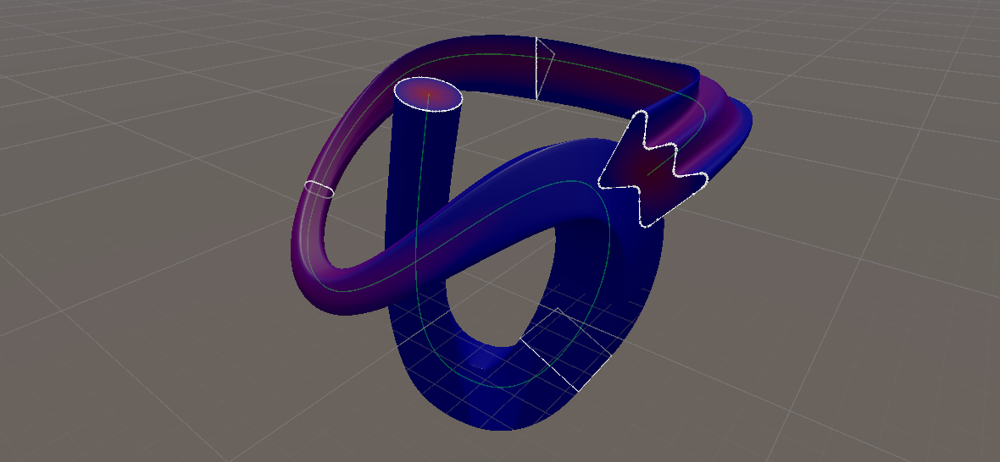
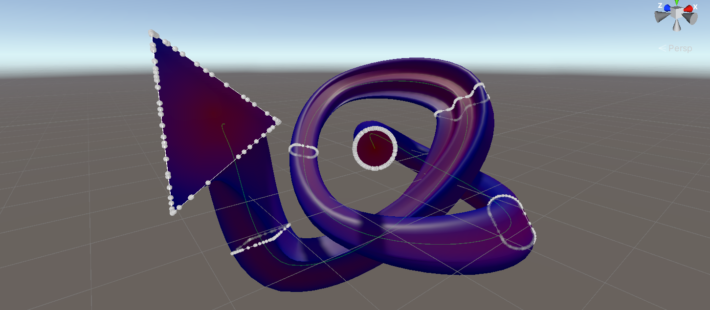
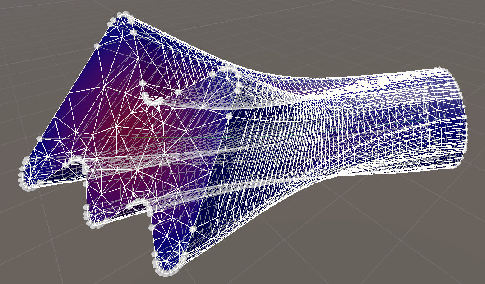
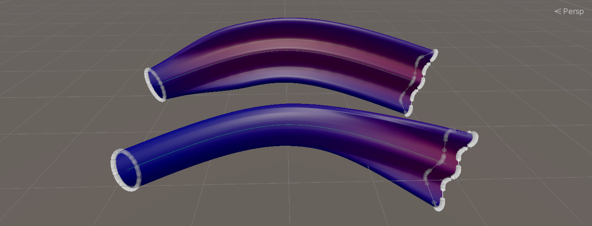
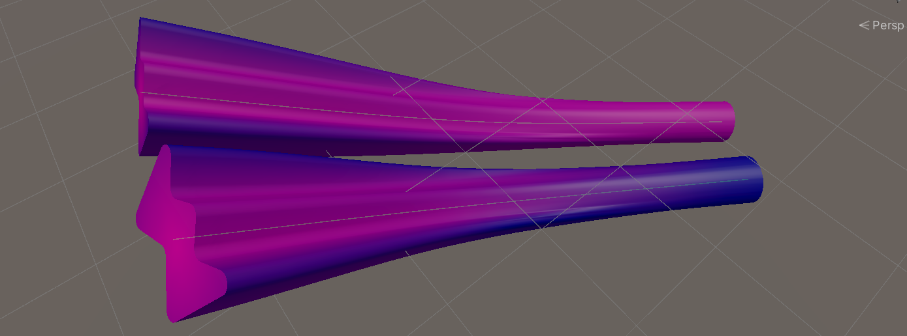

# Sweep Line Generator for Unity

We decided to create a unity tool for game developers to be able to create complex 3D shapes easily.

> The report describing all the details of the report can be found [here](images/Modelling_and_Visualizing_Sweep_Objects.pdf)

## Sweep Object

A sweep object is a 3D shape obtained by moving an cross section along a line. This can be as simple as creating a cylinder from a circle and a straight line. However, to create more complex shapes we need to be able to do more than just taking a straight line and a single 2D object to sweep along it. This includes but is not limited to: sweeping along the curved lines, interpolating between multiple cross-sections, rotating the cross-section around the line, and scaling the cross-section.

## Exampes

